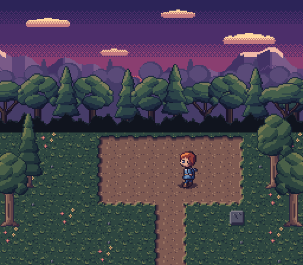
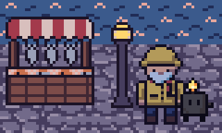
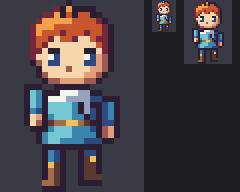

# pxart

Pixel art as text. A sprite is a small plain-text file (a palette, then a grid of
characters) that renders to PNG. Language models can write it, git can diff it, and
you can read it.

```
# a small face
k #3f2631
g #43e1b3
y #fee761

....kkkk....
...kggggk...
..kgyggygk..
...kggggk...
....kkkk....
```

The tool is built for an author–render–look loop: write rows, render a preview with a
pixel grid and coordinate rulers, look at it, fix, and repeat. Animation strips show
what actually moved between frames once the whole-body bob is removed, so a walk cycle
that's secretly a bob shows up as a number. When the feet stay put and only the body
above them moves (an idle breathing), the strip shows that instead of lighting up the legs.

## Install

```
pip install git+https://github.com/thethirdbearsolutions/pxart
pxart -h
```

It's also a single file: `python3 pxart.py -h`, with [Pillow](https://pypi.org/project/pillow/)
as the only dependency.

## Examples

[`examples/`](examples/README.md) shows each major feature as `.px` sources beside the
images they produce: animation, palette variants, drawing commands, composing across
packs, tilemaps, import and export, checking.

  

## Format

- **Palette:** one line per key: a single character, then `#rrggbb`, `#rrggbbaa`, or
  `transparent`. `.` is always transparent and needs no line. Keys can be any printable
  ASCII except `# @ . " \`.
- **Grid:** rows of palette keys, all the same width. The sprite's size is the grid's
  size; nothing is declared or counted.
- **Comments:** lines starting with `#`. A comment right above a line is that line's (a key's
  comment); a file's header is the comments above `pxart 1`, or separated from its first line by a
  blank line.
- **Version line (optional):** a first line of `pxart 1`.

### Frames and animation

Several grids can live in one file. Name each with `@frame`. A frame id is a path, and
frames that share a parent path form an animation:

```
pxart 1
@palette dungeon.px
@anim walk/down direction=pingpong ms=125

@frame walk/down/0
..kk..
.kggk.
@frame walk/down/1 ms=250
..kk..
.kgrk.
```

- **`@anim`:** sets a group's `direction` (`forward`, `reverse`, `pingpong`,
  `pingpong_reverse`, the same words Aseprite uses), `repeat` and default `ms`.
- **`@frame … ms=`:** overrides the duration for that frame.
- **`pivot=x,y`** on `@frame` or `@anim` (optional; a frame's own wins): the frame's anchor
  pixel from its top-left, say the feet. `anim` and `onion` line frames up by pivot instead
  of bottom-centre, and `export` writes it (`--aseprite` as Aseprite's own slice keys,
  `--frames` as `pivots.json`). `anim-set hero.px:walk pivot=8,23` sets it.
- **`anim-set`** writes both: `anim-set hero.px:walk/down ms=125 direction=pingpong`
  updates (or adds) the `@anim` line, and `anim-set hero.px:walk/down/1 ms=250` sets one
  frame's `ms` (or `pivot`). Only that line changes; `ms=` with no value clears it.
- **`@palette file.px`:** imports keys from a palette-only file, so a whole sprite set
  shares one palette. Keys defined locally win. A path inside a file (`@palette`, a map's
  legend) is read from that file's directory; a path typed on the command line (`--match`,
  `--palette`, `--labels`, ...) from the current directory, and an `E_FILE` says so.
- **`@variant night`:** followed by key lines, defines a recolor, rendered with
  `--variant night`. A variant a sprite gets only from its `@palette` can't know the
  sprite's own keys and leaves them at their base colors (a white wick at dusk): every
  command that renders it prints a `WARNING` naming them, `check` says so too, and
  `palette wick.px --variant dusk --derive-from base --match pal.px --keep-lit M,m` gives the
  sprite a dusk of its own, fitted to the palette's, with its lights kept lit: the WARNING
  prints that command, the lights inferred from the file's other variants (a key one leaves at
  base or brightens: `M left at base in night`).
- **`@still ui/life`:** a frame group that isn't an animation; `@still *` marks every
  frame, top-level ids included (a parts file). `anim-set ui.px:ui/life --still` writes it
  (`--no-still` removes it, and a plain `ui.px` means `*`); `new ui.px:ui/life/0 --still`
  starts a still group.

Any command that takes a file also takes `file.px:walk/down` (a whole group) or
`file.px:walk/down/0` (one frame); `'file.px:*'` (quoted for the shell) is every frame, as a
plain `file.px` is. Pixel coordinates address one frame, so on a file of several frames `set`,
`fill --region`, `line`, `rect`, `poly`, `ellipse`, `arc`, `flood`, `paste --at`, `mask --keep`
and a `--region` of `shift`, `recolor` or `shade` want one of these, and the `E_SELECT` lists
the frames. An edit that changes several frames names them before `wrote`: `edited 16 frames:
walk/down/0, walk/down/1, walk/down/2 and 13 more`. A file with one unnamed grid calls it by the file's
name (`ant.px:ant`, as `frames` lists it); writing a named frame into it (`compose -o
ant.px:ant`) first turns the grid into `@frame ant`. In zsh write `"${F}:walk/down"`:
`"$F:walk/down"` applies a modifier, and a missing input like `hero.pxalk/down` is
reported as that mistake.

### Errors

Every problem in a file is reported at once with a stable code and a location:

```
hero.px:14: E_UNKNOWN_KEY (frame walk/down/1, row 2, x=[3]): keys 'q' aren't in the palette
```

Every error line starts with the command (`ellipse: E_BAD_ARG: ...`), and one that fails
on an input file also says which input:

```
compose: layer 2 (parts.px:hat): parts.px:4: E_ROW_WIDTH (frame hat, row 1): row is 1 wide, ...
```

A command that fails prints no notes or WARNINGs: they describe the write it was about to
make, and nothing was written. A command that writes into a directory that doesn't exist makes it and
says so: `created out/`.

Unknown `@sections` are kept as-is, or rejected with `check --strict`.

## Commands

`pxart help recipes` walks through six workflows end to end, command by command: port a pack
and prove it lossless, merge packs with variants, build a dusk or night, slice a sheet, make a
scene from a map, check an animation's feet. `pxart -h` is a short overview: the format in a few
lines and the commands by topic.
`pxart help all` has the full reference, `pxart help TOPIC` one part of it (FORMAT,
LOOKING, CHECKING, EDITING, DRAWING, CONVERTING, HELP, ERRORS), and `pxart CMD -h` (or
`pxart help CMD`) prints one command's part (`pxart poly -h`): its usage and a line or three
saying what it's for, its options one per line, then the details and heuristics, then a
see-also line naming the shared notes of the reference it relies on (EDITING, FORMAT:
selecting frames, ...) rather than repeating them. zsh users: write `"${F}:walk"`, not
`"$F:walk"`; `pxart -h` says so in a box. `compose` and `palette`, the two longest, open with a short list of rules
(a new OUT imports the layers' shared `@palette`; variants merge by name; ...) and examples;
`pxart help compose-rules` and `pxart help palette-rules` print only the rules.

- **Looking:** `render` (`--png` also writes each single-frame `.px` at 1x, `FILE.png` beside it
  or in `--png DIR`, and prints the path; `--plain` writes one frame alone at its exact size, no grid,
  rulers or labels, to `diff` against a scene's PNG), `sheet` (a directory stands for every `.px` under it, sorted by
  path, and palette files are skipped with a note; `--exclude GLOB` leaves files out, `room.px`
  or a folder `wip`, in `check` and `stats` too; frames with one id from several files
  are labeled `hero:idle/0`, `beast:idle/0`; every cell is the largest frame's size, or
  with `--fit` each frame's own, rows as tall as their tallest, and a frame over 8x the median
  frame's area gets a note saying what it costs; `--align pivot` lines up
  each animation's frames by pivot, as `anim` does; `--rows group` puts each animation group
  on a row of its own), `anim` (one GIF, each
  frame at `--scale` with its 1x and 2x copies beside it in the same picture, plus a
  motion strip; without `-o` it prints only the per-frame numbers, like `shift +0,-1 then
  72px (20%)`, and writes nothing; "rows Y+ still" only when those rows are
  pixel-identical and the legs keep their shape in every frame (an idle; a walk frame
  whose legs happen to stay put reads as its bob, `shift +0,+1 then 23px`), and for the
  rise and the fall of one breath alike; a ground tile or a sparse overlay like falling
  snow that scrolls with wrap-around reads `shift -1,+4 (wrap)`), `onion` (B over A drawn
  as a red silhouette, and a printed readout of how B's edges moved from A's, like `top -1,
  bottom +0`, for a 1px jump too faint to see, and the best shift, or for two different
  characters `different sprites: edges only`; `--feet N` or `--rows Y0-Y1` reads only
  that band, so a weapon swing doesn't hide the feet; `--tint-a COLOR` picks the
  silhouette's color and `--fade-a` draws A faded instead),
  `scene` (.px/.png items at x,y, negative allowed, on a 96x64 scene unless `--size` or `--map`
  says otherwise, pixels past its edge cropped with a note, mirrored with a `+h`/`+v` suffix as in
  `hero.px:walk/0+h@3,4`; `--variant V` recolors the whole room; `--tint '#10183080'` lays
  a translucent color over the finished scene for night; an item or legend entry ending in
  `%base` keeps its base palette, a lamp in a night room; `--bg transparent` works, as
  does `transparent` anywhere a color is typed), and `tint`, which does the same to a PNG.
  `--dry-run` on `render`, `sheet`, `anim`, `onion` and `scene` prints the readout (notes and
  WARNINGs too) and each output's size and layout (`sheet.png: 700x174 px, 5 frames in one row,
  every cell 128x128 ...`) and writes nothing, saying `(dry run; nothing written)`; `-o` may
  then be left off. An image over 4096 px on a side or 16M px gets a `WARNING`, dry run or not.
- **Maps** (`scene --map`): a legend line is `<char> <path>`, and the rest of the line
  is the path, so a pack folder with spaces works as is (quotes optional). A legend
  entry that can't load is an error at its legend line. A `#` line before the rows is a
  comment unless it is exactly `# FILE.px[:frame][%variant]` or `# FILE.png` (or a
  quoted path), which makes `#` a map char (a wall row `####`); `check` and `scene` note
  it. A line `---` after the rows starts another layer of rows over the same legend (a
  tile and a sprite in one cell); later layers draw on top, and `.` is empty. Each item
  draws from its cell's top-left, so a prop bigger than a tile hangs right and down; a
  legend entry ending in `+b` (`+hb` with a flip) stands it on its cell instead,
  bottom-aligned and centered (`L props/lamp.px+b`). `pxart help LOOKING` has a worked map.
  `compose --map room.map -o room.px` builds the map's room as a `.px` frame instead of a PNG,
  with compose's palette, `--rekey` and `--variant-map` rules; it renders as `scene --map` does,
  pixel for pixel, in every variant. A new OUT's header says how it was made (`# composed by:
  pxart compose --map room.map -o room.px`, paths from its folder), so a variant `WARNING` about
  it can offer composing it again once the map's sprites have that variant.
- **Checking:** `check` (format errors, size, off-palette colors, color budget, unused
  keys; `.map` tilemaps too; `check crossover/` checks every `.px` and `.map` under it;
  notes Cyrillic/Greek/fullwidth letters posing as ASCII and `@anim`/`@still` lines with
  no frames, which `--strict` fails; one line per file, the failing frames under it, and a
  summary like `6 files, 150 frames, 3 warnings`; `-v` for a line per frame; exits 1), `stats` (a directory too, as for `sheet`; `stats
  hero.px:idle/0%night --colors` lists the colors a variant renders, with their keys, and `--at 3,4`
  one pixel's key and color in every variant), `diff A B` (renders pixel by pixel, one line per pair: how many
  pixels differ and where, exit 1 when they do, so a copy can be proved to render as its original;
  `diff town.px pack/ --labels pack/labels.csv` checks every frame against the pack's PNG its row names,
  `diff hero.px out/` against `out/<id>.png`, `diff town/ pack/ --labels pack/labels.csv` every frame of every
  `.px` under `town/` (`--exclude GLOB` leaves some out), and two other directories pair files by path; a transparent pixel
  matches any other unless `--strict-alpha`; `-o DIFF.png` draws A, B and the differing pixels in magenta
  side by side, or for several pairs `-o DIR` one picture per pair that differs; a size mismatch against a
  render or a scaled copy gets a note naming `render --plain`),
  `frames` (`--rm`/`--move` print only what they did, and a move to where the frames
  already are says `already in place`; with a selector, `frames hero.px:walk/left` lists
  those frames, `--rm` removes them and `--after ID` moves them; removing a group's last
  frame removes its `@anim`/`@still` line; `frames hero.px:walk --copy-to beast.px
  [--after ID]` copies frames into another file, in order, with their ms, pivots and
  `@anim` line (a copy that lands as a still, a top-level id, drops its ms and keeps its pivot), under other ids with `--prefix wick/` or `--rename walk wick/walk`;
  `frames hero.px --rename walk hero/walk` renames a group in place, `@anim` and `@still`
  lines too, and is the rename there is no `rename` command for; a move puts the `@anim` lines
  in play order).
- **Editing:** `new` (a blank or filled frame, in a new or existing file; `new party.px
  --empty --palette palette.px` starts a file with no frames that imports a palette, for
  `frames --copy-to` to fill), `put` (`put hero.px:walk/1 < rows.txt` replaces one
  frame's grid with rows from stdin, with optional
  palette lines merged like `compose`'s; checked like a file, errors at stdin's lines,
  nothing written on an error, and only that frame's lines change), `fill` (a region or
  the whole frame with one key), `flip`, `shift` (the pixels it leaves behind become `.`,
  or `--fill KEY`), `set`, `crop`, `recolor` (optionally within a region; `'a<>b'` swaps
  two keys, quoted for the shell; `'a>b'` gives a's pixels a new key b in a's color, a
  rename when nothing keeps a, and onto a key already in a's color the error says `a=b`; the key moves of one call apply together, so none feeds
  another, and a key renamed away is free for another: `'a>b' 'b>a'` swaps two names), `mask` (erase outside `--keep x,y,w,h` or `--keep-circle cx,cy,r`, with a
  `--dither N` edge; `--invert` erases the inside instead; both flags repeat, and the kept
  area is the union, so two lamps are one call; works on a rendered PNG too; `--keep-keys
  W,T,t` or `--drop-keys` mask a .px by key), `paste` (`+h`/`+v` mirror the source, as in
  `compose`; `--under` fills only the empty pixels), `compose` (stack layers into a frame;
  a new frame lands after its animation; a new file gets the layers' whole palette, their
  shared `@palette` re-pointed when they all import the same one, so a later `shade` ramp
  finds its keys, or with `--used-keys-only` only the keys its frame uses, and the
  comments on their key and `@variant` lines, each naming its file when there are several
  (`from keeper.px's @variant night, dusk here`; a `@variant`'s names only the files whose
  variant lines gave it keys, `the rest from pal.px's night`), with the palette files' headers at the
  top; a key its file needs (drawn in other frames,
  named, or kept lit by a variant) that it has to leave out is a `WARNING`; it reports per
  source file, one line per reason, with what `--rekey` moved and why, and an `E_KEY_CONFLICT`
  offers the same moves; each variant colors only
  the layers whose file has it, a note says which stay at their base colors, and
  `--variant-map dusk=night,dark` merges several files' variants into one (it adds to the
  same-name lookup, never replaces it: OUT's night still reads each file's night); a plain OUT that
  exists keeps its palette, with a note, and `--replace` starts it as if new; `--under` draws
  the layers behind the frame that's there, in its empty pixels; a key a layer has in
  another color than OUT's is `E_KEY_CONFLICT`, one line per source file with free keys
  for it, and `--rekey` gives it those keys in OUT and leaves the source file alone, as it
  does for `crop`, `paste` and `frames --copy-to`; `--rekey` also gives free keys to a key
  two files have in one color but recolor differently in their variants, into a new file or
  an existing one (`frames keeper.px:walk --copy-to party.px --rekey --variant-map
  dusk=night` reads the keeper's night as party.px's dusk), and in a new OUT to a needed key
  it would leave out; a key OUT's variants would recolor is a `WARNING` of its own;
  `--rekey o,r` moves only those keys, and `--rekey k=j,n=q` puts k and n on OUT's own j and
  q, with a `WARNING` where their variant colors differ; `--rekey girl.px:T=V` is for one
  source file's T only; a color two files share, alike in every variant, keeps the one key
  it got first), `dup` (copy a frame), `anim-set` (timing), `palette
  --add` (with `--variant night` it sets keys in that variant, making it if needed;
  `--variant night --keep l,g` lets keys inherit the base colors; `--variant night
  --derive-from base --darken 0.35 --tint '#10183060' --keep-lit y,W` builds a whole night
  from the base colors, as `scene --tint` would, with the lamps still lit; `--match
  mossback.px%dusk` first maps each channel as another palette's base to dusk does (a fitted
  gain and offset: warm lights, blue shadows), and a key darker than a quarter is never
  brightened, by Rec. 709 luma (hue kept), unless `--lift-darks`; `--hoist l,g`
  moves a sprite's own keys into the palette file it imports; `--import pal.px` adds a
  `@palette pal.px` line to a sprite and drops its key lines pal.px has in the same colors, so it
  renders as before; `--order o,t,k` puts those key lines first, comments and all; `--remove k,n` takes out keys
  no frame draws with (`--to j` repaints their pixels as j first; an imported key then goes from
  its palette file only when no other `.px` under the directory holding both, or `--in DIR`, uses
  it); `--comment k 'text'`,
  `--comment @variant night 'text'` and `--comment-header 'text'` write the comment above
  a key line, a variant or the file; `palette FILE` alone lists the keys with their comments, then what each
  variant recolors darker or brighter, relists in its base color and inherits, with its
  comment: `night: recolors (darker) k w; brightens y; relists unchanged: l g; inherits: e E q`;
  `--in DIR` says how many files under DIR import a palette file and draw with each key; any
  edit takes `-o OUT` for an edited copy, and `--dry-run` prints the diff it would make and
  writes nothing). Edits rewrite only the lines
  that changed, keeping the file's blank lines and comments, and an edit that changes
  nothing says `no change` and leaves the file alone. `-o OUT` always writes the whole
  file: `flip hero.px:walk/0 -o out.px` is a copy of hero.px with that frame flipped, and
  an `OUT` in another directory gets its `@palette` lines re-pointed from there, so it
  imports the same palette file. `extract hero.px:walk -o walk.px` writes only the
  selected frames, with the same palette and imports (and their `@anim` lines, in the
  order of the frames' groups); `--inline-palette` copies the imported keys they use (and
  the variants' colors for them) into the file and drops `@palette`, so the hand-off
  renders the same with nothing beside it. extract writes a new file: onto one that exists it is an error
  (its frames would be lost), unless `--replace`; `frames --copy-to` adds to it instead.
- **Drawing** (for 32x48 heroes, 64x64 beasts and 256-wide layers, where typing every
  pixel is the bottleneck; each draws a palette key on `FILE[:SEL]`, clipped to the frame,
  and rewrites only the rows it changed):
  - `line hero.px:attack/2 W 3,40 28,12 --width 2`: Bresenham, no doubled corners.
  - `poly … x,y x,y x,y … [--fill]`: a closed polygon from line's pixels (filled by nonzero
    winding, so a star is solid).
  - `rect … x,y,w,h [--fill]`, `ellipse … cx,cy,rx,ry [--fill]` (clean, symmetric pixel
    ellipses; `.5` centers and radii for even sizes), `flood … x,y [--diagonal]`.
  - `arc … cx,cy,r a0,a1 --width 3`: a smear or swoosh (degrees, 0 = right, counter-clockwise).
  - `shade hero.px:idle/0 --ramp XxcCw --keys c --light nw`: re-shades a material with a
    darkest-to-lightest ramp. Each pixel's tone comes from its outward normal against the
    light, fading to the base tone `--strength` px in from the edge: banded, deterministic,
    no noise (`--dither` for an ordered blend at band boundaries, `--preview p.png` to look
    first; `--region` repaints only inside it, shaded as part of the whole material, so its
    border is no edge).
  - `outline beast.px:idle --key o --lit m`: an outline around the shape (or `--inside` on
    its edge), pixel-perfect by default (`--corners` keeps square corners), and selective:
    the edges facing the light get the lighter `--lit` key (`--preview p.png` as for shade).
  - Both print only the pixels they changed, by the key they got: `changed 41 px: 29->C, 12->X`.
  - `rotate FILE 90|180|270` and `transpose` turn path tiles into their edges and corners
    (then re-light with `shade` and `outline --lit`, since the light turned too).
- **Converting:**
  - `export --frames DIR` writes one PNG per frame. `export town/ --frames out/` exports every `.px` under
    `town/` (several files and directories, `--exclude GLOB` as for `check`); an id two files share, or two
    that differ only in case (one file on macOS), is an error rather than one PNG replacing another, and
    `--prefix-file` ids them `roofs/roof-red`.
  - `export --aseprite x.json` writes a sprite sheet and JSON with frameTags (and pivots as
    `meta.slices`, the shape Aseprite's own export uses).
  - `export --tiled x.tsj` writes a tileset with tile animations.
  - `export harbor.px:cobble harbor.px:water --tiled t.tsj` exports only those frames
    (selectors of one file add up), so a tileset can leave out the big props.
  - Frame and tile ids count over the exported frames with each animation group
    contiguous, groups in order of first appearance, and all top-level frames together as
    one group. A file that already keeps each group together gets ids in file order;
    otherwise a frame moves up to its group (`a/0 b/0 a/1` gives `a/0 a/1 b/0`).
  - `palette --export x.gpl|x.hex` writes the palette; `palette hero.px --extract-to pal.px`
    writes it as a palette file for `@palette`, variants included, with the comments on its
    key and `@variant` lines (and a palette file's header), and `--repoint` then makes
    hero.px import it.
  - `from-png` converts a PNG to a sprite; `from-png Walk.png --grid 16x16 --by cols --names
    walk/down,walk/up,walk/left,walk/right -o boy.px` slices a sheet into frames, a group per
    column (or row), skipping empty cells. Two PNGs one run would give one id (two packs'
    `tile_0002.png`) are an error rather than one replacing the other; `--prefix-dir` ids them
    `dungeon/tile_0002` and `creatures/tile_0002`. Loose PNGs take names from `--names a,b,...` (one per
    PNG) or from the CSV a pack ships: `--labels dungeon/labels.csv` names each PNG by its row's
    `proposed_name` (`--label-col`, `--file-col` pick other columns).

## Prior art

pxart's grid-plus-keyed-palette format is close to XPM2 without its header. It sits in
the same family as the sprite formats of
[PuzzleScript](https://www.puzzlescript.net/Documentation/objects.html),
[MakeCode Arcade](https://arcade.makecode.com/developer/images) and Bitsy.
[PixTXT](https://github.com/Fantety/PixTXT) (MIT) is the nearest standalone format.
pxart's optional version line, built-in transparent `.`, located error codes, palette
variants and lenient handling of unknown sections all come from it.

## License

MIT
