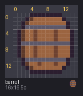
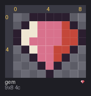
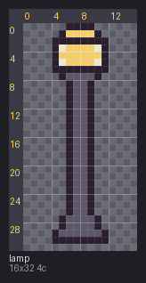
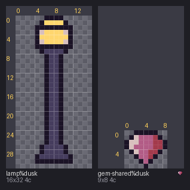

# 01 · Format basics

You'll read a sprite file, draw a gem of your own in a text editor, and then have the gem
share its colors with a street lamp, so both can switch to dusk together.


## The idea

A pxart sprite is a plain text file ending in `.px`. It has two parts. First come the
colors, one per line: a letter, then a hex color. Then comes the picture, drawn with those
letters, one letter per pixel. From [`barrel.px`](barrel.px):

```px
b #9b6440
B #5e3a2a

....kkkkkkkk....
...kBbbbbbbbk...
```

So `b` is a light brown and `B` a dark one, and the second row of the barrel starts with
three empty pixels, an outline pixel, a dark one, then light ones. A `.` is always an
empty (see-through) pixel; you never list it.

Because it's text, you can make and change a sprite in any editor, and pxart turns it
into pictures.


## Before you start

From this folder, copy just the source files into a new folder of your own and go
there. The commands below then make every output fresh, and print exactly what's shown
here:

```sh
mkdir -p ~/pxart-01
cp barrel.px gem.px lamp.px palette.px ~/pxart-01/
cd ~/pxart-01
```

`~` is your home folder, and `-p` keeps `mkdir` quiet if the folder is already there.
The [examples README](../README.md) says how to make `pxart` a command you can type.


## Step 1: Look at the barrel

Open [`barrel.px`](barrel.px) in a text editor. The top of it is:

```px
# A barrel from the harbor-market pack: a palette, then the grid.
pxart 1
k #2b1e2f
G #5d5869
b #9b6440
B #5e3a2a
h #6e4230
```

- A line starting with `#` is a comment, for people.
- `pxart 1` says which version of the format this is. It usually comes first, after any
  comments, but it's optional.
- The five letter lines are the barrel's colors (its *palette*). Each letter is a *key*.

After a blank line, the grid: 16 rows of 16 letters. Now draw it:

```sh
pxart render barrel.px -o barrel.preview.png --png
```

- `render` draws a preview for looking at while you edit: every pixel as an 8x8 block,
  with a grid and rulers so you can count pixels.
- `-o barrel.preview.png` is the output file.
- `--png` also saves the sprite at its real size, one image pixel per sprite pixel, as
  `barrel.png` beside `barrel.px`. That small file is what a game would use.



The grey checkerboard shows the empty `.` pixels.


## Step 2: Draw a gem

Make a new file called `gem.px` and type this into it (the folder already has a copy, if
you'd rather not type):

```px
# A gem: four colors, then the picture, one letter per pixel.
pxart 1
k #2b1e2f
w #efe6d2
p #d8718c
r #c4473a

..kkkkk..
.kwppprk.
kwwppprrk
kwpppprrk
.kwpprrk.
..kpprk..
...kpk...
....k....
```

`k` is the outline, `w` a white shine on the upper left, `p` the pink body and `r` the
red shadow on the right. Every row has to be the same width, here 9.

Draw it bigger, since it's only 9x8 pixels:

```sh
pxart render gem.px --scale 16 -o gem.preview.png
```

`--scale 16` draws every pixel as a 16x16 block instead of render's usual 8x8.




## Step 3: A sprite with no colors of its own

Open [`lamp.px`](lamp.px). It has a grid but no color lines. Instead it has this:

```px
pxart 1
@palette palette.px
```

`@palette palette.px` means "take my colors from [`palette.px`](palette.px)". That file
is only colors: the harbor pack's 20 keys, which all its sprites share. Change a color
there and every sprite that uses it changes.

```sh
pxart render lamp.px -o lamp.preview.png --png
```




## Step 4: Give the gem the shared palette

The gem's four colors are the same as four in `palette.px`, so the gem can share that
palette too. `palette --import` does it for you:

```sh
pxart palette gem.px --import palette.px -o gem-shared.px
```

- `palette gem.px --import palette.px` adds `@palette palette.px` to the gem and drops its
  own color lines, since `palette.px` has the same colors.
- `-o gem-shared.px` writes the result to a new file and leaves `gem.px` as it was.

pxart says what it did:

```text
imported palette.px (@palette palette.px); dropped k w p r (their key lines: the same colors in palette.px); gem-shared.px now has palette.px's @variant dusk; wrote gem-shared.px
```

The top of [`gem-shared.px`](gem-shared.px) is now just:

```px
# A gem: four colors, then the picture, one letter per pixel.
pxart 1
@palette palette.px
```

The picture is untouched, so it draws exactly the same.


## Step 5: Dusk for free

`palette.px` has a second set of colors, called `dusk`, after a line `@variant dusk`
near its end. Anything that uses the palette can be drawn in those colors instead.
`render` takes several files at once:

```sh
pxart render lamp.px gem-shared.px --variant dusk -o dusk.preview.png
```

`--variant dusk` draws with the dusk colors, and each label says so (`lamp%dusk`). You never
picked a dusk color for the gem: it got them by sharing the palette.



[03 · Palette variants](../03-variants) shows how to make variants like `dusk` yourself.


## The picture at the top

`scene` places sprites on one canvas and saves a PNG, each at an x,y position (the
sprite's top-left corner). `%dusk` after a file name draws that one sprite in its dusk
colors:

```sh
pxart scene --size 96x40 --bg '#dfe8e6' -o shelf.x4.png \
  barrel.px@4,20 lamp.px@24,4 gem-shared.px@42,28 lamp.px%dusk@62,4 gem-shared.px%dusk@80,28
```

`--size 96x40` is the canvas in pixels, and `--bg` its background color (quoted, so the
shell doesn't read `#` as a comment). `scene` scales everything up 4x unless told
otherwise, hence the `.x4` in the name.


## Try it yourself

- **Recolor the gem.** In `gem.px`, change `p #d8718c` to `p #3f7fa8` and `r #c4473a` to
  `r #26496e` (the pink and its red shadow become two blues), and run the Step 2 command again for a blue gem.
- **Hide the grid.** `pxart render gem.px --scale 16 --no-grid -o plain.png` draws the
  gem without the grid lines.
- **See who shares the palette.** `pxart palette palette.px --in .` lists every color
  and says how many `.px` files in this folder use it.


## Commands used

- `pxart render FILE... -o OUT.png`: a preview to look at while you edit. `pxart help render`
- `pxart palette FILE --import P.px -o OUT.px`: make a sprite use a shared palette file.
  `pxart help palette`
- `pxart scene --size WxH -o OUT.png ITEM@x,y ...`: place sprites on one canvas.
  `pxart help scene`

The [Commands section](../../README.md#commands) of the main README covers all of them.
