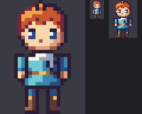
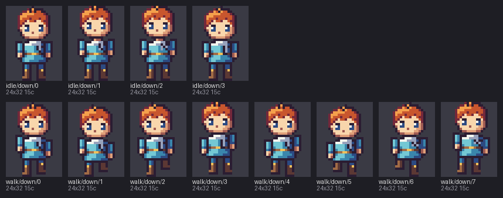
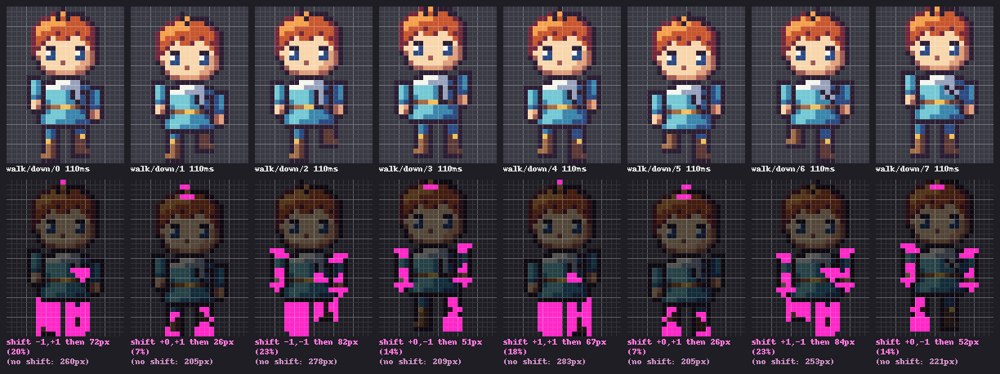
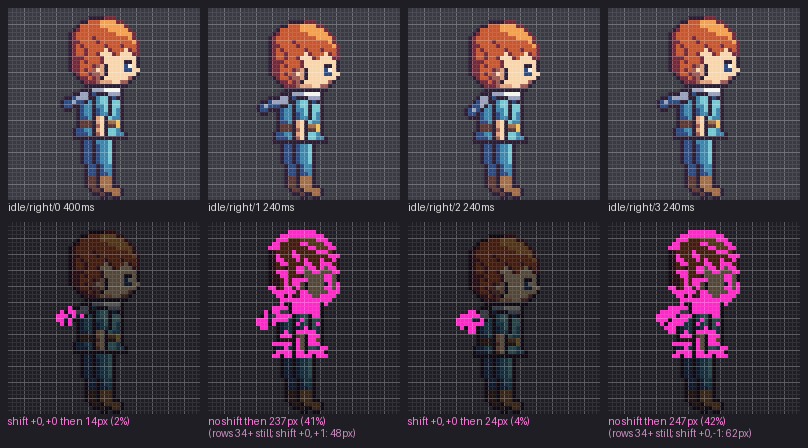
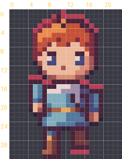
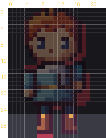

# 02 · Animation

You'll look inside a hero's walk and his idle breathing, play both as GIFs, and use
pxart's numbers to check that each frame moves the way you meant it to.

 


## The idea

One `.px` file can hold many pictures. Each is a *frame* with a name, like
`walk/down/3`: frame 3 of the *group* `walk/down`. An `@anim` line turns a group into an
animation, with how long each frame shows and where the character's feet are. From
[`hero.px`](hero.px):

```px
@anim idle/right ms=240 pivot=23,47
@anim walk/down ms=110 pivot=12,31
```

Then each frame starts with an `@frame` line, followed by its grid of letters, like the
sprites in [01 · Format basics](../01-format). pxart plays the frames in number order.


## Before you start

Copy this folder somewhere and `cd` into the copy, so the commands below don't
overwrite the files here. The [examples README](../README.md) says how to make `pxart`
a command you can type.


## Step 1: Read the animation lines

Open [`hero.px`](hero.px) in a text editor. Near the top are the two `@anim` lines above.
What they say:

- `ms=110`: each walk frame shows for 110 milliseconds, about nine frames a second.
- `pivot=12,31`: the pixel under the hero's feet, counted from the frame's top-left
  corner, which is 0,0. x grows to the right and y grows *down*, so in a 24x32 walk
  frame, 12,31 is the middle of the bottom row. pxart lines frames up on this pixel.

Further down, one frame changes its own timing:

```px
@frame idle/right/0 ms=400
```

The first idle frame stays up for 400 ms instead of the group's 240, a little pause
before each breath.


## Step 2: See every frame

`sheet` lays frames out side by side on one PNG, each labeled with its name:

```sh
pxart sheet hero.px --fit --rows group --align pivot --scale 4 -o sheet.png
```

- `--fit` gives each frame a cell its own size. The idle frames are 48x48 and the walk
  frames 24x32, so the default (every cell as big as the largest frame) would waste room.
- `--rows group` starts a new row for each group.
- `--align pivot` lines up a group's frames by their pivot, so you can see the body move
  up and down from frame to frame.
- `--scale 4` draws every pixel as a 4x4 block.
- `-o sheet.png` is the output file.




## Step 3: Play the walk

`anim` turns a group into a GIF. `hero.px:walk/down` means "the `walk/down` frames of
`hero.px`": a colon, then the group.

```sh
pxart anim hero.px:walk/down -o walk.gif --scale 6
```

The GIF shows the walk at 6x, with 1x and 2x copies beside it so you can also see it at
the size a game would draw it:


`anim` also writes [`walk.strip.png`](walk.strip.png) and prints one line of numbers per
frame. The next step reads them.


## Step 4: Read the walk's numbers

Two of the lines `anim` printed:

```text
  walk/down/0                110ms  vs walk/down/7: shift -1,+1 then 72px (20%) (no shift: 260px)
  walk/down/1                110ms  vs walk/down/0: shift +0,+1 then 26px (7%) (no shift: 205px)
```

Each line compares a frame with the one before it (frame 0 with frame 7, since the walk
loops). When you walk, your whole body bobs up and down, and pxart first finds that bob:

- `shift +0,+1` means the whole hero moved 0 pixels sideways and 1 pixel down (+1 is
  down, because y grows down).
- `then 26px (7%)` is what still changed after taking that move out: 26 pixels, 7% of
  the hero. That's the arms and legs, the part you actually drew.
- `(no shift: 205px)` is how many pixels changed without taking the bob out. Most of
  those are just the bob.

In [`walk.strip.png`](walk.strip.png), the top row is the frames and the bottom row
marks in pink exactly those leftover pixels:



If a walk frame shows `then 0px`, nothing moved but the bob: the legs are missing a pose.


## Step 5: Play the idle

The idle is different: the legs stand still and only the body above them breathes.

```sh
pxart anim hero.px:idle/right -o idle.gif --scale 4
```

Two of its lines:

```text
  idle/right/0               400ms  vs idle/right/3: shift +0,+0 then 14px (2%)
  idle/right/1               240ms  vs idle/right/0: no shift then 237px (41%) (rows 34+ still; shift +0,+1: 48px)
```

Frame 0 shows its own 400 ms from Step 1. For frame 1, shifting the whole hero would
make the still legs look like they moved, so pxart doesn't shift. It says `no shift`,
and `rows 34+ still`: row 34 and every row below it are exactly the same as in the frame
before. That's how you know the feet are planted. The shift it would have used comes
last, for comparison.




## Step 6: Lay one frame over another

A 1-pixel move is easy to miss by eye. `onion` draws one frame over a red silhouette of
another, and says how the edges moved:

```sh
pxart onion hero.px:walk/down/0 hero.px:walk/down/1 -o onion.png
```

`hero.px:walk/down/0` names one frame: the group, a slash, and the frame's number. The
first frame is A (the silhouette), the second is B.

```text
B vs A: left +0, right +0, top +1, bottom +0; best shift +0,+1 then 26px changed (no shift: 205px)
```

`top +1`: B's top edge is 1 pixel lower than A's, so the head dropped. `bottom +0`: the
feet stayed on the ground. The red peeking out above the head is where A was:




## Step 7: Check just the feet

To see whether a foot lifted, look only at the bottom rows:

```sh
pxart onion hero.px:walk/down/0 hero.px:walk/down/3 --feet 6 -o onion-feet.png
```

`--feet 6` counts only the bottom 6 rows, so a swinging arm above doesn't get mixed in.
The image darkens the rows it isn't looking at.

```text
B vs A (bottom 6 canvas rows 26-31; A opaque in 26-31, B in 26-30): left +0, right +0, top +0, bottom -1; best shift +0,-1 then 9px changed (no shift: 11px)
```

`bottom -1`: in frame 3 the lowest pixel is 1 row higher (it stops at row 30, not 31).
One foot is off the ground.




## Try it yourself

- **Slow it down.** `pxart anim hero.px:walk/down --fps 4 -o slow.gif --scale 6` plays
  the walk at 4 frames a second, whatever the `ms` in the file say.
- **Just the numbers.** `pxart anim hero.px:idle/right`, with no `-o`, prints the lines
  and writes nothing.
- **The other foot.** `pxart onion hero.px:walk/down/4 hero.px:walk/down/7 --feet 6 -o
  feet47.png` should show the other foot lifting the same way.


## Commands used

- `pxart sheet FILE -o OUT.png`: every frame side by side. `pxart help sheet`
- `pxart anim FILE:GROUP -o OUT.gif`: a GIF, a strip and a line of numbers per frame.
  `pxart help anim`
- `pxart onion FILE:A FILE:B -o OUT.png [--feet N]`: one frame over another's silhouette.
  `pxart help onion`

The [Commands section](../../README.md#commands) of the main README covers all of them.
