# 04 · Drawing tools

You'll draw a treasure chest without touching a single pixel by hand: eleven pxart
commands, from an empty frame to a shaded, outlined chest with a gem on its lock.


## The idea

In [01 · Format basics](../01-format) you drew by typing letters into a grid. pxart can
also draw for you: a rectangle, a line, a filled shape, shading, an outline. Each command
takes the `.px` file, the letter (*key*) to paint with, and some positions, and it changes
the file in place. For example, `pxart rect chest.px b 2,9,20,10 --fill` paints a filled
rectangle of `b` (light wood) into `chest.px`.

The colors come from [`palette.px`](palette.px), and the whole script is
[`draw.sh`](draw.sh): one command per line, the same ones as the steps below.


## Before you start

From this folder, copy just the source files into a new folder of your own and go
there. The commands below then make every output fresh, and print exactly what's shown
here:

```sh
mkdir -p ~/pxart-04
cp draw.sh palette.px ~/pxart-04/
cd ~/pxart-04
```

`~` is your home folder, and `-p` keeps `mkdir` quiet if the folder is already there.
The [examples README](../README.md) says how to make `pxart` a command you can type.

Positions are x,y in pixels, counted from 0,0 at the top-left corner; x grows to the
right and y grows *down*. The pictures below have rulers so you can check them.

To look at your chest after any step, run the command from
[the last section](#the-finished-chest) and open `chest.preview.png`. That's how the
pictures below were made.


## Step 1: Start an empty frame

```sh
pxart new chest.px --size 24x20 --palette palette.px
```

- `new chest.px` makes a new file.
- `--size 24x20` makes its one frame 24 pixels wide and 20 tall, all empty (`.`).
- `--palette palette.px` adds the line `@palette palette.px`, so the chest uses those
  colors.

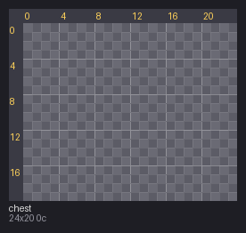


## Step 2: The body

```sh
pxart rect chest.px b 2,9,20,10 --fill
```

`rect` draws a rectangle given as `x,y,w,h`: its top-left corner at 2,9, then 20 wide and
10 tall. Without `--fill` you'd get only its border.

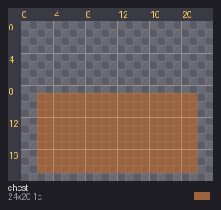


## Step 3: The lid

```sh
pxart poly chest.px b 3,9 5,3 18,3 20,9 --fill
```

`poly` draws a shape through a list of corners (x,y each), joined back to the first.
These four make a lid that's narrower at the top.

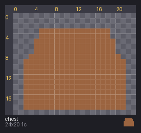


## Step 4: Shade the wood

Flat wood looks like cardboard. `shade` repaints a material in a range of tones, light
where it faces the light and dark where it faces away:

```sh
pxart shade chest.px --ramp Bhbo --keys b --light nw --strength 3
```

- `--ramp Bhbo` is the tones to use, darkest first: `B` dark brown, `h`, `b` (the wood
  itself, in the middle), then `o`, a light orange.
- `--keys b` repaints only the `b` pixels.
- `--light nw` puts the light at the top-left (north-west).
- `--strength 3` lets the shading reach 3 pixels in from each edge.

It prints how many pixels got each tone:

```text
changed 100 px: 7->B, 57->h, 36->o; wrote chest.px
```

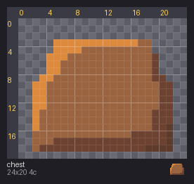


## Step 5: The band across the lid

```sh
pxart line chest.px G 2,9 21,9 --width 2
```

`line` draws from one point to another, here straight across at y=9, in `G` (dark iron).
`--width 2` makes it 2 pixels thick.

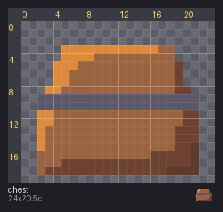


## Step 6: The left strap

```sh
pxart rect chest.px G 5,3,2,16 --fill
```

The same `rect` as Step 2: 2 wide and 16 tall, from the top of the lid to the bottom.

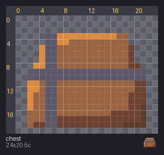


## Step 7: The right strap

```sh
pxart rect chest.px G 17,3,2,16 --fill
```

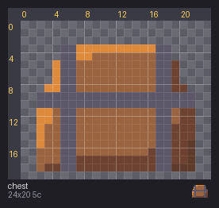


## Step 8: Turn the iron gold

The band and both straps touch, so they're one connected patch of `G`. `flood` repaints
a whole connected patch at once, like a paint bucket:

```sh
pxart flood chest.px Y 5,15
```

5,15 is a pixel on the left strap. Every `G` pixel connected to it becomes `Y` (gold).

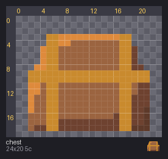


## Step 9: The lock

```sh
pxart ellipse chest.px y --box 9,8,6,6 --fill
```

`ellipse` draws a round shape that fits in a box: `--box 9,8,6,6` is x,y,w,h like
`rect`'s, so this is a 6x6 circle of `y` (light gold).

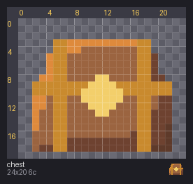


## Step 10: The gem

```sh
pxart poly chest.px r 11,9 12,9 12,12 11,12 --fill
```

A small `poly`: four corners that make a 2x4 block of `r` (red) in the lock.

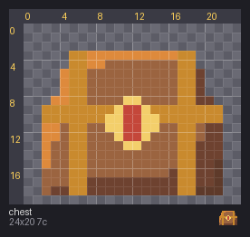


## Step 11: The outline

```sh
pxart outline chest.px --key k --lit B
```

`outline` draws a 1-pixel line around the whole shape, in the empty pixels just outside
it.

- `--key k` draws it in `k`, the darkest color.
- `--lit B` uses `B` (dark brown) instead on the sides that face the light, the top and
  the left. A softer outline there makes the chest look lit.

```text
changed 66 px: 36->k, 30->B; wrote chest.px
```

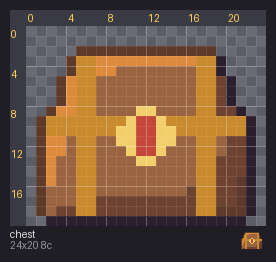


## The finished chest

Render it once more, big, and save it at its real size too:

```sh
pxart render chest.px --scale 10 -o chest.preview.png --png
```

`--scale 10` draws each pixel as a 10x10 block, with a grid and rulers. `--png` also saves
the chest at its real size, 24x20, as [`chest.png`](chest.png): the file a game would use.


## Try it yourself

- **A bigger lock.** In Step 9, use `--box 8,7,8,8` for an 8x8 lock around the same
  middle; the gem in Step 10 still sits in its center.
- **Light from the other side.** Use `--light ne` in Step 4 and in Step 11
  (`pxart outline chest.px --key k --lit B --light ne`), and the chest is lit from the
  top-right.
- **Try before you commit.** At Step 4, run the `shade` command with `--preview try.png`
  on the end first: it draws what shading would do into `try.png` and leaves `chest.px`
  alone. Then run it without `--preview` to shade for real.


## Commands used

- `pxart new FILE --size WxH --palette P.px`: an empty frame. `pxart help new`
- `pxart rect FILE KEY x,y,w,h [--fill]`: a rectangle. `pxart help rect`
- `pxart poly FILE KEY x,y x,y ... [--fill]`: a shape through corner points.
- `pxart line FILE KEY x0,y0 x1,y1 [--width N]`: a line.
- `pxart ellipse FILE KEY --box x,y,w,h [--fill]`: a circle or oval in a box.
- `pxart flood FILE KEY x,y`: repaint the connected patch at x,y.
- `pxart shade FILE --ramp KEYS --keys KEYS --light DIR`: shade a material.
- `pxart outline FILE --key K [--lit L]`: outline the shape.

`pxart help COMMAND` has the details of each. The [Commands section](../../README.md#commands)
of the main README covers all of them.
