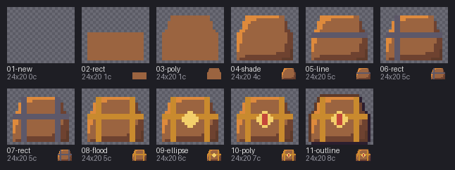

# 04 · Drawing tools

A treasure chest made only with commands, starting from a blank frame that imports
[`palette.px`](palette.px). [`draw.sh`](draw.sh) is the whole script: `rect` and `poly`
block in the wood, `shade` re-lights it with a dark-to-light ramp, `line` and `rect` add
the iron bands, `flood` turns the connected iron gold, `ellipse` and `poly` make the lock
and its gem, and `outline --lit` draws the outline, lighter on the lit edges.

```sh
pxart new chest.px --size 24x20 --palette palette.px
pxart rect chest.px b 2,9,20,10 --fill
pxart poly chest.px b 3,9 5,3 18,3 20,9 --fill
pxart shade chest.px --ramp Bhbo --keys b --light nw --strength 3
pxart line chest.px G 2,9 21,9 --width 2
pxart rect chest.px G 5,3,2,16 --fill
pxart rect chest.px G 17,3,2,16 --fill
pxart flood chest.px Y 5,15
pxart ellipse chest.px y 11.5,10.5,2.5,2.5 --fill
pxart poly chest.px r 11,9 12,9 12,12 11,12 --fill
pxart outline chest.px --key k --lit B
```

After each step ([`steps/`](steps) keeps a copy of `chest.px` after every command):



The result, [`chest.px`](chest.px), and its 1x [`chest.png`](chest.png):

 

Every command prints what it did ([`draw.txt`](draw.txt)):

```text
$ pxart poly chest.px b 3,9 5,3 18,3 20,9 --fill
painted 94 px; wrote chest.px
$ pxart shade chest.px --ramp Bhbo --keys b --light nw --strength 3
changed 100 px: 7->B, 57->h, 36->o; wrote chest.px
$ pxart outline chest.px --key k --lit B
changed 66 px: 36->k, 30->B; wrote chest.px
```
