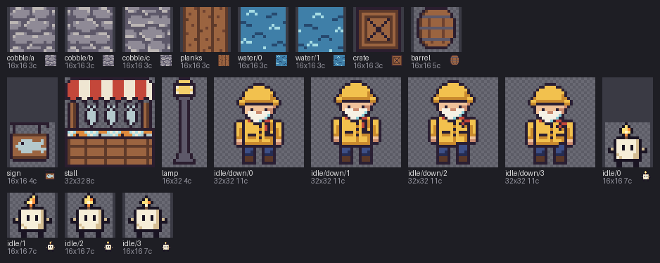

# 05 · Compose across packs

You'll build one scene, a harbor dock with a lighthouse keeper and a candle called Wick,
out of three sprite packs that were never meant to go together, and then turn the whole
dock to dusk at once.


## The idea

A *pack* here is a folder of sprites that share one palette file. This folder has three:
[`harbor-market`](harbor-market) (tiles, a stall, a lamp), [`lighthouse-keeper`](lighthouse-keeper)
and [`wick`](wick). Each picked its letters on its own, so the same letter means different
colors. Here is `k`, the outline color, in each palette:

```px
k #2b1e2f
k #2a1f33
k #1a1423
```

(from `harbor-market/palette.px`, `lighthouse-keeper/palette.px` and `wick/pal.px`: three
slightly different near-blacks.)

`compose` copies frames from any files into one new `.px`, and brings their colors with
them. When two packs disagree about a letter, it stops and tells you, and `--rekey` fixes
it by giving the newcomer's letters unused ones. The packs' own files never change.


## Before you start

Copy this folder somewhere and `cd` into the copy, so the commands below don't
overwrite the files here. The [examples README](../README.md) says how to make `pxart`
a command you can type.


## Step 1: Look at the three packs

```sh
pxart sheet harbor-market/harbor.px lighthouse-keeper/keeper.px wick/player.px --fit --scale 4 -o packs.png
```

`sheet` shows every frame of the three files side by side, each labeled with its name.
(`--fit` gives each frame a cell its own size; `--scale 4` draws each pixel 4x4.)



The dock will use the harbor's `water/0` and `cobble` tiles, its `stall` and `lamp`, the
keeper's `idle/down/0` and Wick's `idle/0`.


## Step 2: List the layers

The dock is 19 frames at 19 positions, the same kind of list `scene` takes
(`FILE:FRAME@x,y`, each frame's top-left corner). Store the list in the shell once, so the
next commands can reuse it:

```sh
H=harbor-market/harbor.px
layers=(
  ${H}:water/0@0,0 ${H}:water/0@16,0 ${H}:water/0@32,0 ${H}:water/0@48,0 ${H}:water/0@64,0
  ${H}:cobble/a@0,16 ${H}:cobble/b@16,16 ${H}:cobble/c@32,16 ${H}:cobble/a@48,16 ${H}:cobble/b@64,16
  ${H}:cobble/c@0,32 ${H}:cobble/a@16,32 ${H}:cobble/b@32,32 ${H}:cobble/c@48,32 ${H}:cobble/a@64,32
  ${H}:stall@2,6 ${H}:lamp@36,8
  lighthouse-keeper/keeper.px:idle/down/0@42,14 wick/player.px:idle/0@62,28
)
```

- `H=...` is a short name for the harbor file, and `${H}` pastes it back in.
- `layers=( ... )` stores the 19 items as a list. `"${layers[@]}"` in a command pastes
  all of them, in order.

The order matters: later layers are drawn on top. So the water and cobbles are layers
1 to 15, the stall 16, the lamp 17, the keeper 18 and Wick 19.


## Step 3: Try to compose, and read the error

```sh
pxart compose -o dock.px --size 80x48 "${layers[@]}" --replace
```

- `-o dock.px` is the new file; `--size 80x48` its size in pixels.
- `--replace` starts `dock.px` over if it's already there (your copy of this folder
  has one). Without it, compose would add to the old file's colors.

It fails, with one long line per pack that doesn't fit (cut short here; the whole of it
is in [`conflict.txt`](conflict.txt)):

```text
compose: layer 18 (lighthouse-keeper/keeper.px:idle/down/0): E_KEY_CONFLICT: 4 keys of this layer are other colors in the new dock.px: 'c' #8ccfd6 (#a6dce4 there, from layer 1 (harbor-market/harbor.px:water/0)), ...
compose: layer 19 (wick/player.px:idle/0): E_KEY_CONFLICT: 5 keys of this layer are other colors in the new dock.px: ...
(exit 1)
```

How to read the first line: layer 18, the keeper, uses 4 letters that already mean
something else in `dock.px`. For `c`, the keeper's color is `#8ccfd6`, but `dock.px`
already has `#a6dce4` for `c`, from layer 1, the harbor's water. `E_KEY_CONFLICT` is the
name of this kind of error (a *key* is pxart's word for a palette letter).

Each line then ends with the fix: add `--rekey`.


## Step 4: Rekey

```sh
pxart compose -o dock.px --size 80x48 --rekey "${layers[@]}" --replace
```

`--rekey` gives each clashing letter a free one in `dock.px`, so every pixel keeps its
own color. It prints a note for each pack, like this one for Wick:

```text
note: --rekey gives wick/player.px's keys free ones in dock.px: 'b>x' 'c>z' 'f>C' 'k>D' 'w>E' (wick/player.px is unchanged)
```

`'k>D'`: Wick's `k` is written as `D` in `dock.px`. And `wick/player.px is unchanged`:
only the new file uses the new letters.

Now look at the dock in its dusk colors. `%dusk` picks the variant, as in
[03 · Palette variants](../03-variants):

```sh
pxart scene --size 80x48 -o dock-halfdusk.x4.png dock.px%dusk@0,0
```


The harbor went dusky, but the keeper and Wick are still in daylight. Among compose's
notes (all in [`rekey.txt`](rekey.txt)) is why:

```text
note: dock.px's @variant dusk covers layers 1-17 (harbor-market/harbor.px) only: layer 18 (lighthouse-keeper/keeper.px:idle/down/0) and layer 19 (wick/player.px:idle/0) stay at base colors in it
note: to give every layer one variant, merge them: --variant-map dusk=night,dark (each layer takes the first of dusk, night, dark its file has)
```

Each pack calls its darker colors something else: the harbor's is `dusk`, the keeper's
`night` and Wick's `dark`.


## Step 5: One dusk for everyone

Do what the note says:

```sh
pxart compose -o dock.px --size 80x48 --rekey --variant-map dusk=night,dark "${layers[@]}" --replace
```

`--variant-map dusk=night,dark` means: make a `dusk` in `dock.px`, and for each layer,
use its pack's `dusk`, or `night` if it has none, or else `dark`. Render the dusk again:

```sh
pxart scene --size 80x48 -o dock-dusk.x4.png dock.px%dusk@0,0
```


Now all three packs darken together. `dock.px` is an ordinary sprite file; its first
line, `# composed by: pxart compose ...`, is the command that made it, so you can make it
again later.


## The picture at the top

The daytime dock, then the two renders side by side (`--scale 1` keeps them the size
they are; each is 320 pixels wide, so the second goes at x=336, after a 16-pixel gap):

```sh
pxart scene --size 80x48 -o dock.x4.png dock.px@0,0
pxart scene --size 656x192 --scale 1 -o panels.x4.png dock.x4.png@0,0 dock-dusk.x4.png@336,0
```


## Try it yourself

- **Move Wick.** Change `wick/player.px:idle/0@62,28` in the list to `@24,30`, run
  Steps 2 and 5 again, and render: he's standing by the stall now.
- **Rekey a copy instead.** The end of the keeper's error line in
  [`conflict.txt`](conflict.txt) is a `pxart recolor lighthouse-keeper/keeper.px ... -o
  rekeyed/keeper.px` command. Run it, put `rekeyed/keeper.px` in the list in place of
  `lighthouse-keeper/keeper.px`, and compose without `--rekey`: only Wick's error is left.
- **Only what's drawn.** Add `--used-keys-only` to Step 5, and `dock.px` gets only the
  letters its pixels actually use: compare `pxart palette dock.px` before and after.


## Commands used

- `pxart compose -o OUT.px --size WxH [--rekey] [--variant-map NAME=V1,V2] FILE:FRAME@x,y ...`:
  stack frames from any files into one new sprite. `pxart help compose`
- `pxart scene --size WxH -o OUT.png FILE%VARIANT@x,y`: render it. `pxart help scene`
- `pxart sheet FILE... -o OUT.png`: every frame side by side. `pxart help sheet`

The [Commands section](../../README.md#commands) of the main README covers all of them.
