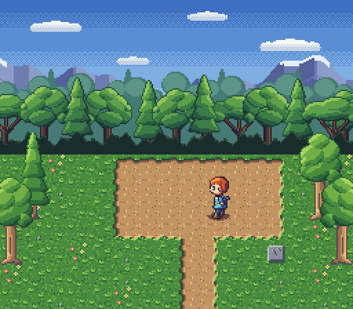

# 06 · Scenes and maps

[`rooms/glade.map`](rooms/glade.map) is a text tilemap: legend lines (`a
../tiles/field.px:grass_a`), then rows of legend characters, with `---` starting another
layer over the same legend. Its four layers are a 256-wide sky, a tree line, the field
tiles, and the trees (`T ../tiles/tree.px:tree+b`: `+b` stands the 32x64 tree on its cell,
and `+hb` mirrors it too). `scene --map` draws it; items after it (the hero and his shadow)
go on top. `--variant dusk` renders every tile and item in its palette's dusk.

```
pxart check rooms/glade.map
pxart scene --map rooms/glade.map --scale 2 -o glade.x2.png \
  tiles/field.px:shadow_s@150,154 sprites/hero.px:walk/left/0@147,127
pxart scene --map rooms/glade.map --scale 2 --variant dusk -o glade-dusk.x2.png \
  tiles/field.px:shadow_s@150,154 sprites/hero.px:walk/left/0@147,127
```

| base | `--variant dusk` |
|---|---|
|  |  |

The field layer and the tree layer of the map:

```
abfab1NNNNNN2baf        ................
bacaaWppppppEcab        .P............T.
afbabWppppppEaba        ................
bcaab3SS78SS4bfa        T..............t
abafbcabWEbasbab        ................
fbabacbaWEabcafb        ................
abcabfabWEbabacb
```

[`check.txt`](check.txt): `ok   rooms/glade.map: map 16x14 tiles, 22 legend char(s), 4 layers`.
[`scene.txt`](scene.txt) notes the tree pixels cropped at the edges. 1x:
[`glade.png`](glade.png), [`glade-dusk.png`](glade-dusk.png).
