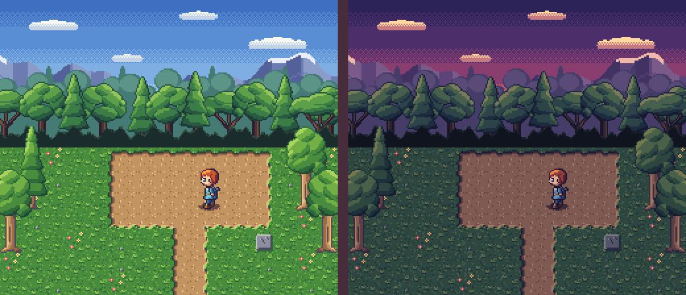
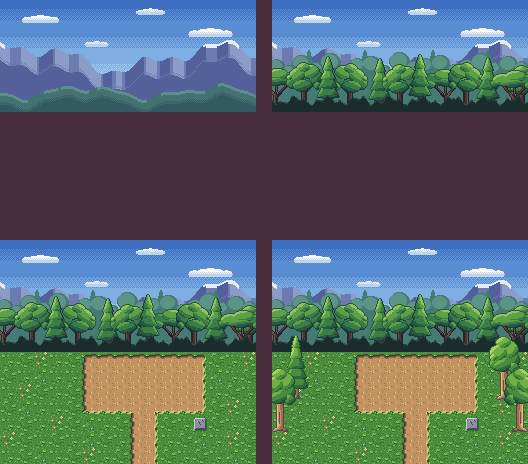

# 06 · Scenes and maps

You'll lay out a forest glade from 16x16 tiles in a plain text file, stack a sky, a tree
line and some trees over it in layers, put the hero in the middle, and render it by day
and at dusk.




## The idea

Games build their levels from small square *tiles*: grass, a path edge, a path corner.
A `.map` file is a text picture of a level. First it says which letter stands for which
tile, then it draws the level with those letters, one letter per tile. Two lines from
[`rooms/glade.map`](rooms/glade.map):

```map
a ../tiles/field.px:grass_a
```

```map
abfab1NNNNNN2baf
```

The first says `a` means the `grass_a` frame of `tiles/field.px`. The second is one row
of the level: 16 tiles, 16 pixels each, so 256 pixels across. `scene --map` turns the
whole file into one picture.


## Before you start

From this folder, copy just the source files into a new folder of your own and go
there. The commands below then make every output fresh, and print exactly what's shown
here:

```sh
mkdir -p ~/pxart-06
cp -R rooms pal layers tiles sprites ~/pxart-06/
cd ~/pxart-06
```

`~` is your home folder, and `-p` keeps `mkdir` quiet if the folder is already there. `-R` copies the folders with everything in them.
The [examples README](../README.md) says how to make `pxart` a command you can type.

The folder is laid out like a small game: `tiles/` holds the tile sheets, `layers/` the
big background pictures, `sprites/` the hero, `pal/` their palettes, and `rooms/` the map.


## Step 1: Read the legend

Open [`rooms/glade.map`](rooms/glade.map). It starts with a comment, then the *legend*:
22 lines, each a letter and a frame. A few of them:

```map
F ../layers/far.px:far
a ../tiles/field.px:grass_a
N ../tiles/field.px:path_n
1 ../tiles/field.px:path_nw
T ../tiles/tree.px:tree+b
t ../tiles/tree.px:tree+hb
```

- The paths start from the map file's own folder, `rooms/`, so `../tiles/field.px` is
  `tiles/field.px` in this folder.
- `F` is the whole sky, one 256-pixel-wide picture. It's drawn at its letter's cell, like
  any tile, and simply covers more than one cell.
- `N` is the path's top (north) edge and `1` its top-left (north-west) corner. The map
  needs a tile for every edge and corner of the dirt path.
- `+b` stands a frame on the bottom of its cell, centered. A tree is 32x64, much bigger
  than its 16x16 cell, so it grows up out of it. `+hb` does the same and also flips the
  tree left to right (`h` for horizontal), so the two edges of the glade don't look
  copied.


## Step 2: Read the rows and the layers

After the legend comes a blank line, then the rows. `.` is an empty cell. A line `---`
starts a new *layer*: another set of rows, drawn over the ones before. The glade has four:

1. the sky `F`, in the top-left cell;
2. the tree line `M`, in the third row;
3. the ground: grass, flowers and the dirt path, in the bottom seven rows;
4. the trees `T`, `t` and `P`, over the grass.

The bottom seven rows of layers 3 and 4 (rows 7 to 13 of the map's 14), side by side:

```map
abfab1NNNNNN2baf        ................
bacaaWppppppEcab        ................
afbabWppppppEaba        .P............T.
bcaab3SS78SS4bfa        ................
abafbcabWEbasbab        T..............t
fbabacbaWEabcafb        ................
abcabfabWEbabacb        ................
```

In layer 3, `1NNNNNN2` over `W....E` over `3SS78SS4` is the edge of the square of path,
and `78` are the corners where the path turns down. In layer 4, each tree sits on a grass
cell of the layer below.

Here are the first layer alone, then the first two, three and all four
(build.sh makes this picture; you don't need to):




## Step 3: Check the map

Before rendering, `check` reads the whole map and every file it names:

```sh
pxart check rooms/glade.map
```

```text
ok   rooms/glade.map: map 16x14 tiles, 22 legend char(s), 4 layers
```

16x14 tiles of 16 pixels is 256x224, the size of a Super Nintendo screen. A misspelled
frame name or a missing file would show up here, with its line number.


## Step 4: Render the glade with the hero

```sh
pxart scene --map rooms/glade.map --scale 2 -o glade.x2.png \
  tiles/field.px:shadow_s@150,154 sprites/hero.px:walk/left/0@147,127
```

- `--map rooms/glade.map` draws the map first, all four layers.
- `--scale 2` draws each pixel as a 2x2 block (`scene`'s usual is 4).
- The items after it are drawn on top, each `FILE:FRAME@x,y` with x,y its top-left
  corner in pixels: a small shadow, then the hero standing on it.

```text
note: 308 px of the map fall outside the 256x224 scene (size from --map) and were cropped
```

That note is expected: the trees in the edge columns hang past the sides of the map,
and the parts outside are cut off.


## Step 5: Render it at dusk

Every palette in `pal/` has a `dusk` variant (see [03 · Palette variants](../03-variants)).
`--variant dusk` renders every tile and item in it:

```sh
pxart scene --map rooms/glade.map --scale 2 --variant dusk -o glade-dusk.x2.png \
  tiles/field.px:shadow_s@150,154 sprites/hero.px:walk/left/0@147,127
```


## Step 6: Turn the map into one sprite

A PNG is a dead end: you can't recolor it or switch it to dusk later. `compose --map`
builds the same picture as a `.px` file instead, one 256x224 frame with all the tiles'
colors and their dusk:

```sh
pxart compose --map rooms/glade.map -o glade.px --rekey \
  tiles/field.px:shadow_s@150,154 sprites/hero.px:walk/left/0@147,127 --replace
```

- `--rekey` is needed because the four palettes use some of the same letters for
  different colors; it gives the clashing ones free letters in `glade.px`
  ([05 · Compose across packs](../05-compose) explains it step by step).
- `--replace` starts `glade.px` over if your copy of the folder already has one.

It prints five notes and `wrote glade.px` (all in [`compose.txt`](compose.txt)). One
counts the letters it rekeyed in each file:

```text
...
note: --rekey gave 18 keys free ones in glade.px: rooms/../layers/mid.px 7, rooms/../tiles/field.px 3, rooms/../tiles/tree.px 2, sprites/hero.px 6 (the files are unchanged)
...
note: that's 7 notes in short; -v prints each in full
```

The last one says they stand for seven. With `-v`, compose prints each in full: which
letters became which (the hero's `S` is `I` in `glade.px`), and which layers left out a
color, by number, like `layers 115-118 (rooms/../tiles/tree.px)`. Those aren't the map's
four layers: compose stacks every tile the map places as a layer of its own, in order.
Here that's 118 of them: the sky, the tree line, 112 ground tiles and the 4 trees, so the
trees are layers 115 to 118.

`check` confirms it's one frame, 256x224, with 51 colors:

```sh
pxart check glade.px
```

```text
ok   glade.px: 256x224 51c
     glade.px: unused keys befy (no frame draws with them: 'pxart palette glade.px --remove b,e,f,y' drops them; compose and crop give a new OUT their sources' whole palettes unless --used-keys-only)
```

The second line is a note, not an error: `glade.px` got every color of the four
palettes, and four of them (`b e f y`) aren't drawn anywhere. They do no harm; the note
says how to drop them.

`pxart scene --size 256x224 --scale 2 -o check.png glade.px%dusk@0,0` draws it, and the
picture is the same as Step 5's, pixel for pixel.


## The picture at the top

The two renders side by side (`--scale 1` keeps them the size they are):

```sh
pxart scene --size 1040x448 --scale 1 -o panels.x2.png glade.x2.png@0,0 glade-dusk.x2.png@528,0
```


## Try it yourself

- **Move a tree.** In the last layer of `glade.map`, move the `P` in `.P............T.`
  a few cells to the right and render again.
- **Plant a pine.** The last layer's bottom row is empty. Change it from
  `................` to `...P............`, render again, and a second pine stands in the
  grass at the bottom left.
- **Mirror the hero.** Add `+h` to his frame, `sprites/hero.px:walk/left/0+h@147,127`, and
  he faces right.


## Commands used

- `pxart check FILE.map`: read a map and every file it names. `pxart help check`
- `pxart scene --map FILE.map -o OUT.png [--variant V] [ITEM@x,y ...]`: render a map, with
  items on top. `pxart help scene`
- `pxart compose --map FILE.map -o OUT.px --rekey`: the same, as a `.px` file.
  `pxart help compose`

The [Commands section](../../README.md#commands) of the main README covers all of them.
