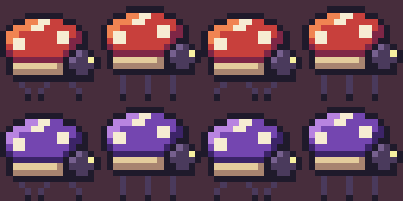
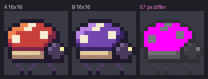

# 07 · Import from PNG

You'll take a sprite sheet PNG of a beetle's two walks, cut it into frames in a `.px`
file, and prove that not a single pixel changed on the way.


## The idea

Most pixel art lives in PNG files. A *sprite sheet* is one PNG with many frames laid out
on a grid, like this one, [`sheet.png`](sheet.png), shown here at 8x:



Each frame is a 16x16 square: four frames of a walk across the top row, four of a darker
cave walk below. `from-png` cuts the sheet along that grid and writes the frames as
letters in a `.px` file, so you can edit them with pxart. `diff` then compares the new
file with the original, pixel by pixel.


## Before you start

From this folder, copy just the source files into a new folder of your own and go
there. The commands below then make every output fresh, and print exactly what's shown
here:

```sh
mkdir -p ~/pxart-07
cp beetle.px beetle_pal.px sheet.png ~/pxart-07/
cd ~/pxart-07
```

`~` is your home folder, and `-p` keeps `mkdir` quiet if the folder is already there. `sheet.png` is the one input that isn't a `.px` file ([the last section](#where-the-sheet-comes-from) shows how it was made).
The [examples README](../README.md) says how to make `pxart` a command you can type.


## Step 1: Cut the sheet into frames

```sh
pxart from-png sheet.png --grid 16x16 --names walk/right,walk_cave/right \
  --palette beetle_pal.px -o imported.px
```

- `--grid 16x16` cuts the sheet into 16x16 squares, row by row.
- `--names walk/right,walk_cave/right` names the rows: the top row's frames become
  `walk/right/0` to `walk/right/3`, the bottom row's `walk_cave/right/0` to `/3`.
- `--palette beetle_pal.px` uses the letters from the beetle's palette file for the
  colors it finds, so the new frames read like the originals. Without it, pxart makes up
  its own letters.
- `-o imported.px` is the new file.

```text
wrote imported.px (8 frame(s): walk/right 4, walk_cave/right 4)
```


## Step 2: Look at what came back

```sh
pxart sheet imported.px --rows group --scale 4 -o imported.png
```

`sheet` lays out every frame with its name; `--rows group` puts each walk on its own row,
and `--scale 4` draws each pixel 4x4.


[`imported.px`](imported.px) is an ordinary sprite file now: open it in a text editor and
the beetle is there in letters.


## Step 3: Prove nothing changed

[`beetle.px`](beetle.px) is the file the sheet was drawn from. `diff` draws both files and
compares every frame pixel by pixel, pairing frames with the same name:

```sh
pxart diff beetle.px imported.px
```

```text
walk/right/0: same: 16x16, every pixel
...
walk_cave/right/3: same: 16x16, every pixel
8 frame(s): 8 same
```

Every one of the eight frames came back exactly. That's what *lossless* means here.


## Step 4: See what a difference looks like

To see `diff` catch something, compare two frames that really are different: the first
frame of the walk against the first of the cave walk.

```sh
pxart diff beetle.px:walk/right/0 imported.px:walk_cave/right/0 -o diff.png
```

`-o diff.png` also draws the two frames side by side, and a third copy with every
pixel that differs in bright pink.

```text
57 px differ in 1,3,12,7 (x,y,w,h)
wrote diff.png
(exit 1)
```

57 pixels differ, all inside the box that starts at x=1, y=3 and is 12 wide and 7 tall:
the shell, which is red in one and purple in the other. `(exit 1)` means `diff` reported
a difference: a script that runs it can tell the two apart from a match, which exits 0.




## Where the sheet comes from

So that this example can be rebuilt from scratch, [`build.sh`](../build.sh) makes
`sheet.png` from `beetle.px` with `scene`, placing each frame in its square, and then
the 8x copy. You don't need to run this; it's here so you can see there's no trick:

```sh
items=()
for i in 0 1 2 3; do
  items+=(beetle.px:walk/right/${i}@$((16 * i)),0 beetle.px:walk_cave/right/${i}@$((16 * i)),16)
done
pxart scene --size 64x32 --scale 1 --bg transparent -o sheet.png "${items[@]}"
pxart scene --size 64x32 --scale 8 -o sheet.x8.png sheet.png@0,0
```

The loop builds a list like `beetle.px:walk/right/2@32,0`: frame 2 of the walk, at x=32
in the top row. `--bg transparent` leaves the empty pixels see-through.


## Try it yourself

- **Put the timing back.** A PNG has no timing, so `imported.px` has no `@anim` lines.
  `pxart anim-set imported.px:walk/right ms=110` adds one, and then
  `pxart anim imported.px:walk/right -o walk.gif --scale 6` plays it.
- **Just one walk.** `pxart diff beetle.px:walk_cave/right imported.px:walk_cave/right`
  compares only the four cave frames.
- **Your own sheet.** Any PNG laid out on a grid works. If its frames aren't 16x16,
  change `--grid`, and leave out `--palette` to let pxart pick letters.


## Commands used

- `pxart from-png SHEET.png --grid WxH --names ROW,ROW -o OUT.px`: cut a sheet into
  frames. `pxart help from-png`
- `pxart diff A B [-o DIFF.png]`: compare two renders pixel by pixel. `pxart help diff`
- `pxart sheet FILE -o OUT.png`: every frame side by side. `pxart help sheet`

The [Commands section](../../README.md#commands) of the main README covers all of them.
