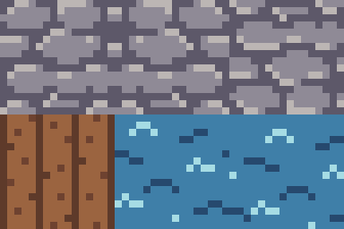
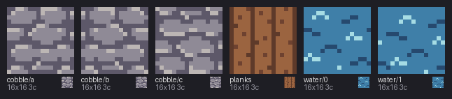

# 08 · Export

You'll turn two `.px` files into what other tools read: a sprite sheet for Aseprite, a
tileset for Tiled, and a folder of plain PNGs, one per frame.


## The idea

A `.px` file is pxart's own format. Game engines and art tools don't read it, so when a
sprite is ready you *export* it: pxart writes the pictures as PNGs, and the rest (frame
names, timing, the pivot under the feet) as a JSON file, a text format for data that
almost every tool can load.

Which export you want depends on where the art goes next:

- **Aseprite** is a popular pixel-art editor. Its sprite-sheet JSON is also read by many
  game engines and their plugins, so it's a common way to hand over animations.
- **Tiled** is a level editor. It builds maps from a *tileset*: one PNG of tiles plus a
  file describing them.
- **Plain frames** are one PNG per frame, for anything else.


## Before you start

From this folder, copy just the source files into a new folder of your own and go
there. The commands below then make every output fresh, and print exactly what's shown
here:

```sh
mkdir -p ~/pxart-08
cp alchemist.px hero_pal.px harbor.px harbor-palette.px ~/pxart-08/
cd ~/pxart-08
```

`~` is your home folder, and `-p` keeps `mkdir` quiet if the folder is already there.
The [examples README](../README.md) says how to make `pxart` a command you can type.

This folder has two sprites: [`alchemist.px`](alchemist.px), a character with a
six-frame walk and a five-frame attack, and [`harbor.px`](harbor.px), six 16x16 ground
tiles, two of which animate the water.


## Step 1: Export the alchemist for Aseprite

```sh
pxart export alchemist.px --aseprite alchemist.json
```

`--aseprite alchemist.json` names the JSON file. The sheet goes beside it, with the same
name:

```text
wrote alchemist.png alchemist.json
```

[`alchemist.png`](alchemist.png) is every frame on one 96x96 image, four to a row (the
picture at the top, at 4x). [`alchemist.json`](alchemist.json) says where each frame is
on it and how long it shows. Its first frame:

```json
{"filename": "walk/right/0", "frame": {"x": 0, "y": 0, "w": 24, "h": 32}, ..., "duration": 100}
```

Then, near the end, the two animations (`frameTags`) and the pivots (`slices`):

```json
"frameTags": [
  {"name": "walk/right", "from": 0, "to": 5, "direction": "forward", "color": "#000000ff"},
  {"name": "attack/right", "from": 6, "to": 10, "direction": "forward", "color": "#000000ff", "repeat": "1"}
],
"slices": [{"name": "pivot", "color": "#0000ffff", "keys": [
  {"frame": 0, "bounds": {"x": 0, "y": 0, "w": 24, "h": 32}, "pivot": {"x": 12, "y": 31}}, ...
```

- The walk is frames 0 to 5 and the attack 6 to 10, in sheet order.
- `"repeat": "1"` on the attack means it plays once instead of looping. It comes from
  `repeat=1` on the attack's `@anim` line in `alchemist.px`.
- The pivot, 12,31, is the pixel under her feet, the same `pivot=` as in
  [02 · Animation](../02-animation). Aseprite keeps it as a *slice* named `pivot`.


## Step 2: Export the harbor tiles for Tiled

```sh
pxart export harbor.px --tiled harbor.tsj
```

```text
wrote harbor.png harbor.tsj
```

[`harbor.png`](harbor.png) is the tileset image: the six tiles, three to a row. Here it
is at 8x:



Tiled numbers tiles from 0, in the order they are in the `.px` file. `sheet` shows them
in that order, labeled with their frame names: counting from 0, `cobble/a` to `cobble/c`
are tiles 0 to 2, `planks` is 3, and `water/0` and `water/1` are 4 and 5.



[`harbor.tsj`](harbor.tsj) (a Tiled tileset, in JSON) gives the size of the tiles and
the image, and one more thing: tile 4 animates. It shows tile 4, then tile 5, 450 ms
each, from `@anim water ms=450` in `harbor.px`:

```json
{"id": 4, "animation": [{"tileid": 4, "duration": 450}, {"tileid": 5, "duration": 450}],
 "properties": [{"name": "pxart_anim", "type": "string", "value": "water"}]}
```

Paint tile 4 into a Tiled map, and its water moves.


## Step 3: Export one PNG per frame

```sh
pxart export alchemist.px --frames frames
```

```text
created frames/
wrote 11 PNGs under frames (frames/walk/right/0.png ... frames/attack/right/4.png) frames/pivots.json
```

`--frames frames` writes into a folder called `frames`, making it if needed. Each frame's
name is its path: `walk/right/0` becomes `frames/walk/right/0.png`, at its real size,
24x32. Two of them, at 4x:


[`frames/pivots.json`](frames/pivots.json) keeps what a PNG can't, the pivot of each frame:

```json
{"walk/right/0": {"x": 12, "y": 31}, ...
```


## The pictures

The exported PNGs are 1x, too small to see here, so build.sh scales them up with
`scene` (and labels the tiles with `sheet`):

```sh
pxart scene --size 96x96 --scale 4 -o alchemist.x4.png alchemist.png@0,0
pxart scene --size 48x32 --scale 8 -o harbor.x8.png harbor.png@0,0
pxart sheet harbor.px --cols 6 --scale 6 -o harbor-tiles.png
pxart scene --size 56x32 -o frames.x4.png frames/walk/right/0.png@0,0 frames/attack/right/3.png@32,0
```


## Try it yourself

- **Only the walk.** `pxart export alchemist.px:walk/right --aseprite walk.json` exports
  just those six frames, as `walk.png` and `walk.json`.
- **Dusk tiles.** `harbor-palette.px` has a `dusk` variant: `pxart export harbor.px
  --tiled harbor-dusk.tsj --variant dusk` writes a dusk tileset beside the day one.
- **Look inside.** Open `alchemist.json` or `harbor.tsj` in a text editor. It's all
  plain text.


## Commands used

- `pxart export FILE --aseprite OUT.json`: a sheet PNG and Aseprite JSON.
- `pxart export FILE --tiled OUT.tsj`: a Tiled tileset (PNG and JSON).
- `pxart export FILE --frames DIR`: one PNG per frame, and `pivots.json`.

`pxart help export` has the details. The [Commands section](../../README.md#commands) of
the main README covers all of them.
