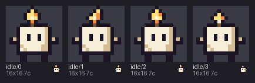

# 09 · Checking

You'll run pxart's checker on a sprite with three mistakes in it, read what it says
about each one, and fix them one at a time until it passes.




## The idea

A `.px` file is text you can type, so it can have typos: a row one pixel short, a letter
that isn't in the palette, a letter that only *looks* like the right one. pxart won't
draw a file with mistakes like these. `check` reads the whole file and lists every
problem at once, each with the line it's on, so you can go straight there.

[`broken.px`](broken.px) is Wick the candle, four idle frames, with three mistakes put in
on purpose. [`fixed.px`](fixed.px) is the same file without them.


## Before you start

From this folder, copy just the source files into a new folder of your own and go
there. The commands below then make every output fresh, and print exactly what's shown
here:

```sh
mkdir -p ~/pxart-09
cp broken.px fixed.px ~/pxart-09/
cd ~/pxart-09
```

`~` is your home folder, and `-p` keeps `mkdir` quiet if the folder is already there. You'll edit your copy of `broken.px`.
The [examples README](../README.md) says how to make `pxart` a command you can type.

You'll also need a text editor that can jump to a line number; most can.


## Step 1: Check the file

```sh
pxart check broken.px
```

```text
FAIL broken.px: 3 error(s)
     broken.px:41: E_ROW_WIDTH (frame idle/1, row 3): row is 15 wide, but 15 of 16 rows are 16 wide: '.....kfiak.....'
     broken.px:63: E_UNKNOWN_KEY (frame idle/2, row 7, x=[7]): keys 'W' aren't in the palette
     broken.px:85: E_UNKNOWN_KEY (frame idle/3, row 11, x=[4]): keys 'с' aren't in the palette
     note: broken.px:85 (frame idle/3, row 11, x=4): 'с' is U+0441 CYRILLIC SMALL LETTER ES, not ASCII 'c'
(exit 1)
```

`FAIL` and three errors. Each error line has the same parts:

- `broken.px:41` is the file and the line number to go to.
- `E_ROW_WIDTH` is the kind of mistake, a fixed name you can look up or search for.
- `(frame idle/1, row 3)` says where in the picture: which frame, and which row of its
  grid. Rows and `x` (the column) count from 0.
- The rest says what's wrong.

`(exit 1)` means `check` failed, which a script can test for. The steps below fix the
errors in order.


## Step 2: A row one pixel short

```text
     broken.px:41: E_ROW_WIDTH (frame idle/1, row 3): row is 15 wide, but 15 of 16 rows are 16 wide: '.....kfiak.....'
```

Every row of a frame must be the same width. This frame's rows are 16 letters wide,
except row 3, which has 15. Go to line 41 of `broken.px` and add one `.` at the end:

```px
.....kfiak......
```

Save, and check again:

```sh
pxart check broken.px
```

```text
FAIL broken.px: 2 error(s)
...
```

One down. (The `...` stands for the remaining errors, listed again as in Step 1.)


## Step 3: A letter that isn't in the palette

```text
     broken.px:63: E_UNKNOWN_KEY (frame idle/2, row 7, x=[7]): keys 'W' aren't in the palette
```

A *key* is a palette letter. The palette at the top of the file has a lowercase `w` (the
wax), but no capital `W`, and case matters. Line 63 has a `W` at x=7, the eighth letter:

```px
...kwwwWwwwck...
```

Make it a `w`, save, and check again:

```sh
pxart check broken.px
```

```text
FAIL broken.px: 1 error(s)
...
```


## Step 4: A letter that only looks right

The last error is the sneaky one:

```text
     broken.px:85: E_UNKNOWN_KEY (frame idle/3, row 11, x=[4]): keys 'с' aren't in the palette
     note: broken.px:85 (frame idle/3, row 11, x=4): 'с' is U+0441 CYRILLIC SMALL LETTER ES, not ASCII 'c'
```

The file's palette has a `c`, and line 85 looks like it has one too. But the note says
that letter is a Cyrillic *es*, from the Russian alphabet, which looks exactly like a
Latin `c`. That happens when text is pasted from somewhere else, or typed with another
keyboard layout.

Go to line 85, delete the fifth letter (x=4), and type a plain `c` in its place. Save,
and check once more:

```sh
pxart check broken.px
```

```text
ok   broken.px: 4 frames, 16x16, 7c
```

`ok`: four 16x16 frames, drawn with 7 colors (`7c`). Your `broken.px` is now the same
as `fixed.px`, apart from the comment on its first line.


## Step 5: Look at it

A file that passes `check` can be drawn. Draw your repaired `broken.px`:

```sh
pxart sheet broken.px --scale 6 -o fixed.png
```

`sheet` puts every frame side by side with its name; `--scale 6` draws each pixel as a
6x6 block.


## Step 6: Count the colors

`stats` says how big a frame is and which colors it uses. `--colors` counts the pixels
of each:

```sh
pxart stats broken.px:idle/0 --colors
```

```text
broken.px:idle/0: 16x16 bbox=(1, 0, 15, 16) colors=7 #1a1423 #7a5238 #d4bd92 #f58b3c #f6eed8 #ffe07a #fff6d0
  #1a1423 58 px (k)
  #f6eed8 41 px (w)
  #d4bd92 13 px (c)
  ...
  #fff6d0 1 px (i)
```

`bbox` is the box around the pixels that aren't empty, as left, top, right, bottom. The
right and bottom are one past the last pixel, so `(1, 0, 15, 16)` covers x from 1 to 14
and y from 0 to 15. Below it, each color, how many pixels use it, and its key: 58 pixels
of outline `k`, and a single pixel of `i`, the bright heart of the flame.


## Try it yourself

- **One line per frame.** `pxart check fixed.px -v` prints `ok` for each frame.
- **Break it yourself.** Delete the `i #fff6d0` line from a copy of `fixed.px` and check
  it: every frame with a flame has an `i` that's no longer in the palette.
- **In the dark.** `fixed.px` has a `dark` variant:
  `pxart sheet fixed.px --scale 6 --variant dark -o dark.png`. The flame stays lit.


## Commands used

- `pxart check FILE [-v]`: find every mistake in a file, with its line. `pxart help check`
- `pxart sheet FILE -o OUT.png`: every frame side by side. `pxart help sheet`
- `pxart stats FILE:FRAME --colors`: size and colors. `pxart help stats`

The [Commands section](../../README.md#commands) of the main README covers all of them.
