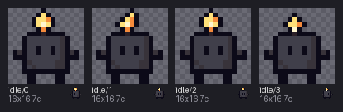

# 09 · Checking

[`broken.px`](broken.px) is [`fixed.px`](fixed.px) with three deliberate mistakes: a row
one pixel short, a key that isn't in the palette, and a Cyrillic `с` typed where the key
`c` belongs. `check` reports every problem at once, each with a stable code and its line,
frame, row and column, and exits 1. A file with errors doesn't render, so this example is
text first.

```sh
pxart check broken.px
pxart check fixed.px -v
pxart stats fixed.px
pxart stats fixed.px:idle/0 --colors
pxart stats fixed.px:idle/0%dark --colors --at 7,3
```

[`check-broken.txt`](check-broken.txt):

```text
$ pxart check broken.px
FAIL broken.px: 3 error(s)
     broken.px:41: E_ROW_WIDTH (frame idle/1, row 3): row is 15 wide, but 15 of 16 rows are 16 wide: '.....kfiak.....'
     broken.px:63: E_UNKNOWN_KEY (frame idle/2, row 7, x=[7]): keys 'W' aren't in the palette
     broken.px:85: E_UNKNOWN_KEY (frame idle/3, row 11, x=[4]): keys 'с' aren't in the palette
     note: broken.px:85 (frame idle/3, row 11, x=4): 'с' is U+0441 CYRILLIC SMALL LETTER ES, not ASCII 'c'
(exit 1)
```

The three lines it points at, as the ordinary `diff fixed.px broken.px` shows them
(the header comment aside):

```diff
41c41
< .....kfiak......
---
> .....kfiak.....
63c63
< ...kwwwwwwwck...
---
> ...kwwwWwwwck...
85c85
< ...kcwwwwwcck...
---
> ...kсwwwwwcck...
```

[`check-fixed.txt`](check-fixed.txt):

```text
$ pxart check fixed.px -v
ok   fixed.px:idle/0: 16x16 7c
ok   fixed.px:idle/1: 16x16 7c
ok   fixed.px:idle/2: 16x16 7c
ok   fixed.px:idle/3: 16x16 7c
```

`stats` reads sizes and colors; `%dark` reads a variant's, and `--at 7,3` one pixel's key
and color (the flame's `i` stays lit in the dark). From [`stats-dark.txt`](stats-dark.txt)
(also [`stats.txt`](stats.txt), [`stats-colors.txt`](stats-colors.txt)):

```text
fixed.px:idle/0%dark: 16x16 bbox=(1, 0, 15, 16) colors=7 #0c0a18 #2b2027 #38333a #403f4a #f58b3c #ffe07a #fff6d0
  #0c0a18 58 px (k)
  #403f4a 41 px (w)
  #ffe07a 5 px (f)
  #fff6d0 1 px (i)
  at 7,3: key i; dark #fff6d0
```

The fixed file, base and `--variant dark`:

```sh
pxart sheet fixed.px --scale 6 -o fixed.png
pxart sheet fixed.px --scale 6 --variant dark -o fixed-dark.png
```

| `fixed.px` | `--variant dark` |
|---|---|
|  |  |
