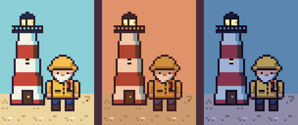
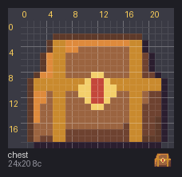
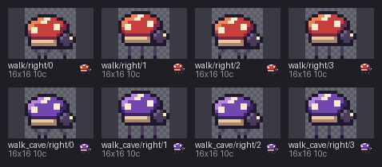
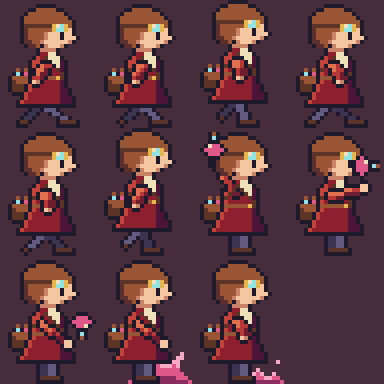

# Examples

Nine short tutorials, each in its own folder, each ending with a picture you made. They
start from what a `.px` sprite file is and build up to animations, day-and-night
palettes, whole scenes, and getting art in and out of other tools. Every step is one
small command, with its output and its picture.


## Start here

Go in order the first time; each one leans a little on the ones before it.

1. [01 · Format basics](01-format): what a `.px` file is; draw a gem by hand.
2. [02 · Animation](02-animation): frames, timing and pivots; check a walk frame by frame.
3. [03 · Palette variants](03-variants): the same drawing by day, at dusk and at night.
4. [04 · Drawing tools](04-drawing): a treasure chest from eleven commands.
5. [05 · Compose across packs](05-compose): one scene from three packs whose colors clash.
6. [06 · Scenes and maps](06-scene): a level from a text tilemap, in layers.
7. [07 · Import from PNG](07-import): cut a sprite sheet into frames, and prove it lossless.
8. [08 · Export](08-export): hand your art to Aseprite, Tiled or anything that reads PNGs.
9. [09 · Checking](09-check): read `check`'s messages and fix a broken file.


## Setting up

Each tutorial runs `pxart` as a command. Either install it:

```sh
pip install git+https://github.com/thethirdbearsolutions/pxart
```

or point an alias at the script in this repo (`/path/to` being where you cloned it):

```sh
alias pxart='python3 /path/to/pxart.py'
```

Then open an example's README. Its "Before you start" copies just that example's source
files into a new folder (`~/pxart-01` and so on) and moves you there, so every output is
made fresh and prints exactly what the README shows. Running the commands in the folder
here would overwrite the files it comes with.


## What's in each

| | Example | You'll use |
|---|---|---|
|  | [01 · Format basics](01-format) | palette lines and a grid; `@palette`; `render`; `palette --import` |
|  | [02 · Animation](02-animation) | `@anim`, `@frame`, ms, pivots; `sheet`; `anim` and its numbers; `onion --feet` |
|  | [03 · Palette variants](03-variants) | `@variant`, `%VARIANT`; `palette --derive-from --keep-lit`, `--add`; the palette listing |
|  | [04 · Drawing tools](04-drawing) | `new`, `rect`, `poly`, `shade`, `line`, `flood`, `ellipse`, `outline` |
|  | [05 · Compose across packs](05-compose) | `compose`, the `E_KEY_CONFLICT` error, `--rekey`, `--variant-map` |
|  | [06 · Scenes and maps](06-scene) | a layered `.map`; `check`; `scene --map`, `--variant dusk`; `compose --map` |
|  | [07 · Import from PNG](07-import) | `from-png --grid`; `diff`, and `diff -o` for a picture |
|  | [08 · Export](08-export) | `export --aseprite`, `--tiled`, `--frames` |
|  | [09 · Checking](09-check) | `check` and its error codes; `stats --colors` |


## How these stay correct

Each folder holds the `.px` sources, the commands, and everything they produce, all
committed. [`build.sh`](build.sh) regenerates every output from the sources, and
`tests/test_examples.py` rebuilds them and checks each is byte-identical, and that every
output a README quotes is what the command really printed. So the tutorials can't drift
from the tool.

After changing a source (or pxart itself), rebuild and commit what changed:

```sh
examples/build.sh                 # in place
examples/build.sh /tmp/ex         # or into another directory
PYTHON=.venv/bin/python examples/build.sh
```

The art is from our own packs (the lighthouse keeper, the harbor market, Wick) and our
own sprites (the SNES-scale hero and glade, the alchemist and her beetle), released with
this repo.
